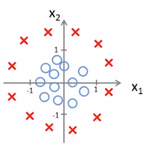

# Classification

###### Examples:

- E-mail: spam or ham?
- Online transactions: fraudulent?
- Tumor: malignant or benign?

$$
y \in \{0, 1\} \quad\quad
\begin{cases}
0: \textrm{"Negative" class} \\
1: \textrm{"Positive" class}
\end{cases}
$$

**Logistic Regression**: $0 \leq h_{\theta}(x) \leq 1$.

### Hypothesis representation

$$
h_{\theta}(\mathbf{x}) = g(\boldsymbol\theta^T \mathbf{x}), \\
\textrm{where}\quad g(z) = \displaystyle\frac{1}{1 + e^{-z}}
$$

- $g(z)$: sigmoid/logistic function.

### Hypothesis interpretation

$h_{\theta}(\mathbf{x})$: estimated probability that $y=1$ on input $x$.
$$
h_{\theta}(\mathbf{x}) =
P(y = 1\ |\ \mathbf{x};\ \boldsymbol\theta) \\
\Rightarrow
P(y=0\ |\ \mathbf{x};\ \boldsymbol\theta) =
1 - h_{\theta}(\mathbf{x})
$$

### Decision boundary

Suppose:

- Predict $y=1$, if $h_{\theta}(\mathbf{x}) \geq 0.5$;
- Predict $y=0$, if $h_{\theta}(\mathbf{x}) < 0.5$.

Since:
$$
g(z) \geq 0.5, \quad \textrm{when} \quad z \geq 0 \\
\quad\textrm{and} \\
g(z) < 0.5, \quad \textrm{when} \quad z < 0
$$
then:
$$
h_{\theta}(\mathbf{x}) = g(\boldsymbol\theta^T \mathbf{x}) \geq 0.5 , \quad \textrm{whenever} \quad
\boldsymbol\theta^T \mathbf{x} \geq 0 \\
and \\
h_{\theta}(\mathbf{x}) = g(\boldsymbol\theta^T \mathbf{x}) < 0.5 , \quad \textrm{whenever} \quad
\boldsymbol\theta^T \mathbf{x} < 0
$$

###### Example:

If $h_{\theta} (\mathbf{x}) = g(\theta_0 + \theta_1 x_1 + \theta_2 x_2)$:

- The model will predict $y=1$ when $\theta_0 + \theta_1 x_1 + \theta_2 x_2 \geq 0$;
- The line defined by the equation $\theta_0 + \theta_1 x_1 + \theta_2 x_2 = 0$ is the decision boundary.

#### Non-linear decision boundaries

The hypothesis could be defined as:
$$
h_{\theta}(\mathbf{x}) = g(\theta_0 + \theta_1 x_1 + \theta_2 x_2 + \theta_3 x_1^2 + \theta_4 x_2^2) .
$$
Then, for:
$$
\boldsymbol\theta =
\begin{bmatrix}
-1 \\ 0 \\ 0 \\ 1 \\ 1
\end{bmatrix} ,
$$
the model would predict $y=1$ when $-1 + x_1^2 + x_2^2 \geq 0$ (a circle of radius $1$ and centered at the origin).

### Logistic regression model

Training set: $\{ (x^{(1)},y^{(1)}), (x^{(2)},y^{(2)}), ..., (x^{(m)},y^{(m)}) \}$;

given that: $x \in \begin{bmatrix} x_0 \\ x_1 \\ \vdots \\ x_n\end{bmatrix}$, $x_0 = 1$, $y \in \{0,1\}$.

Hypothesis: $h_{\theta}(x) = \displaystyle\frac{1}{1 + e^{-\theta^T x}}$.

How to choose parameters $\theta$?

###### Cost function

$$
J(\theta) = \displaystyle\frac{1}{m}\displaystyle\sum_{i=1}^{m} \textrm{Cost}(h_{\theta}, y)
$$

where:
$$
\textrm{Cost}(h_{\theta}, y) =
\begin{cases}
-\log(h_{\theta}(x)), & \textrm{if } y=1 \\
-\log(1 - h_{\theta}(x)), & \textrm{if } y=0 .
\end{cases}
$$

- Intuition:
  - $\textrm{Cost} = 0$, if $y=1$ and $h_{\theta} = 1$;
  - As $h_{\theta} \rightarrow 0$, $\textrm{Cost} \rightarrow \infty$;
    - Captures intuition that if $h_{\theta} = 0$ (*i. e.*, predict $P(y=1\ | x; \ \theta) = 0$), while $y=1$, then the model should be penalized by a very large cost.
  - $\textrm{Cost} = 0$, if $y=0$ and $h_{\theta}=0$;
  - As $h_{\theta} \rightarrow 1$, $\textrm{Cost} \rightarrow \infty$;
    - Captures intuition that if $h_{\theta} = 1$, while $y=0$, then the model should be penalized by a large cost, as well.

Since  $\textrm{Cost}(\cdot)$ can be rewritten as:
$$
\textrm{Cost}(h_{\theta}, y) = - \big[ y \cdot \log \big(h_{\theta}(x)\big) + (1 - y) \cdot \log\big( 1 - h_{\theta}(x) \big) \big]
$$
The cost function can be simplified:
$$
J(\theta) = \displaystyle\frac{1}{m}
\displaystyle\sum_{i=1}^{m}
\textrm{Cost}\big( h_{\theta}(x^{(i)}), y^{(i)} \big) \\
= - \displaystyle\frac{1}{m}
\bigg[ \displaystyle\sum_{i=1}^{m}
y^{(i)} \cdot \log \big(h_{\theta}(x^{(i)})\big) + (1 - y^{(i)}) \cdot \log\big( 1 - h_{\theta}(x^{(i)}) \big) \bigg]
$$
To fit parameters $\theta$ : $\quad\underset{\theta}{min} \ J(\theta)$ .

To make a prediction given new $x$ : $\quad h_{\theta}(x) = \displaystyle\frac{1}{1 + e^{-\theta^T x}}$ .

###### Gradient descent

Repeat {

$\theta_j := \theta_j - \alpha \displaystyle\sum_{i=1}^{m} \big( h_{\theta}(x^{(i)}) -y^{(i)} \big) x^{(i)}_{j}$

}

Algorithm looks identical to linear regression: the definition of $h_{\theta}(x)$ has changed.

**Vectorized implementation:**
$$
\theta := \theta - \displaystyle\frac{\alpha}{m}
X^T \big( g(X\theta) - \vec{y} \big)
$$

- **Feature scaling also applies to Logistic Regression**:
  - It helps the gradient descent algorithm to converge faster.

#### Other optimization algorithms

- Conjugate gradient;
- BFGS;
- L-BFGS.

Advantages:

- No need to manually pick $\alpha$ ;

- Often faster than gradient descent;

Disadvantages:

- More complex.

###### Example:

- $\theta = \begin{bmatrix} \theta_1 \\ \theta_2 \end{bmatrix}$ ;
- $J(\theta) = (\theta_1 - 5)^2 + (\theta_2 - 5)^2$ ;
- $\begin{matrix} \displaystyle\frac{\partial}{\partial \theta_1} J(\theta) = & 2(\theta_1 - 5) \\ \displaystyle\frac{\partial}{\partial \theta_2} J(\theta) = & 2(\theta_2 - 5) \end{matrix}$ ;

Implementation:

~~~octave
function [jVal, gradient] = costFunction(theta)
	jVal = (theta(1)-5)^2 + (theta(2)-5)^2;
	gradient = zeros(2,1);
	gradient(1) = 2*(theta(1)-5);
	gradient(2) = 2*(theta(2)-5);
~~~

Optimization:

~~~octave
options = optimset('GradObj','on','MaxIter','100');
initialTheta = zeros(2,1);
[optTheta, functionVal, exitFlag] ...
	= fminunc(@costFunction, initialTheta, options);
~~~

Template for the cost function:

~~~octave
theta = [theta(1) ; theta(2) ; ... theta(n+1)];

function [jVal, gradient] = costFunction(theta)
	jVal = ... ; % code to compute J(\theta);
	gradient(1) = ... ; % code to compute partial J for theta(1)
	gradient(2) = ... ; % code to compute partial J for theta(2)
	...
	gradient(n+1) = ... ; % code to compute partial J for theta(n+1)
end;
~~~

Vectorized form:

~~~octave
function [jVal, gradient] = costFunction(theta)
  jVal = [...code to compute J(theta)...];
  gradient = [...code to compute derivative of J(theta)...];
end;
~~~

### Multi-class classification

E-mail tagging: Work, Friends, Family, Hobby.

#### One-vs-all (One-vs-rest):

Turns each class to a binary classification problem.
$$
h_{\theta}^{(i)} (x) = P(y=i\ |\ x; \theta), \quad (i = 1,2,3)
$$
where $i$ denotes the class (in the example above, there are three classes).

1. Train a logistic regression classifier $h_{\theta}^{(i)} (x)$ for each class $i$ to predict the probability that $y=i$ ;
2. On a new input $x$, to make a new prediction, pick the class $i$ that maximizes: $\displaystyle\underset{i}{max}\ h_{\theta}^{(i)} (x)$ .

### Over-fitting

- Under-fitting: high bias
  - Despite the data, the model "has" preconceived bias as of the relationship between the variables, in spite of the data points.
- Over-fitting: high variance
  - The number of possible hypotheses is too varied, and there is not enough variables to restrict it.

If we have too many features, the learned hypothesis may fit the training set very well ($J(\theta) = \frac{1}{2m} \displaystyle\sum_{i=1}^{m} \big( h_{\theta}(x^{(i)}) - y^{(i)} \big)^2 \approx 0$), but fail to generalize to new examples (predict prices on new examples).

##### Addressing over-fitting:

1. Reduce number of features:
   1. manually select which features to keep;
   2. model selection algorithm;
2. Regularization:
   1. keep all the features, but reduce magnitude/values of parameters $\theta_j$ ;
   2. works well when we have a lot of features, each of which contributes a bit to predicting $y$ .

### Regularized Linear Regression

##### Intuition

For a model:
$$
h_{\theta}(x) = \theta_0 + \theta_1 x + \theta_2 x^2 + \theta_3 x^3 + \theta_4 x^4 ,
$$
which could over-fit the data, suppose we penalize and make $\theta_3$ and $\theta_4$ really small:
$$
\displaystyle\underset{\theta}{min}\ \displaystyle\frac{1}{2m} \displaystyle\sum_{i=1}^{m} \big( h_{\theta}(x^{(i)}) - y^{(i)}\big)^2 \underline{+ 1000\ \theta_3^2 + 1000\ \theta_4^2} ,
$$
we would end up with $\theta_3 \approx 0$ and $\theta_4 \approx 0$ .

Small values for parameters $\theta_0 , \theta_1, ... \theta_n$:

- "simpler" hypothesis;
- less prone to over-fitting.

##### Generalization

$$
J(\theta) = \displaystyle\frac{1}{2m}
\Bigg[ \displaystyle\sum_{i=1}^{m} \big( h_{\theta}(x^{(i)})-y^{(i)} \big)^2
\underline{+ \lambda\displaystyle\sum_{i=1}^{n} \theta_j^2 } \Bigg]
$$

- Note that the sum in the regularization term does not include $\theta_0$ : the constant term then is no penalized (by convention).
- $\lambda$ : regularization parameter:
  - When this parameter is too large, all parameters $\theta_j$ ($j \neq 0$) approach zero and the model ends up under-fitting the data.

##### Gradient descent

Repeat{

$\theta_0 := \theta_0 - \alpha \displaystyle\frac{1}{m} \displaystyle\sum_{=1}^{m} \big( h_{\theta}(x^{(i)}) - y^{(i)} \big) x_{0}^{(i)}$ ;

$\theta_j := \theta_j - \alpha \bigg[ \displaystyle\frac{1}{m} \displaystyle\sum_{i=1}^{m} \big( h_{\theta}(x^{(i)}) - y^{(i)}\big) x_{j}^{(i)} \color{red} + \displaystyle\frac{\lambda}{n} \theta_j \color{black} \bigg] $ ;

$\quad\quad (j = 1, 2, ..., n)$

}

Rewriting the second equation:
$$
\theta_j := \theta_j \bigg(1 - \alpha \displaystyle\frac{\lambda}{m}\bigg)
- \alpha\displaystyle\frac{1}{m} \displaystyle\sum \big( h_{\theta}(x^{(i)}) - y^{(i)} \big) x_{j}^{(i)}
$$

- $1 - \alpha \displaystyle\frac{\lambda}{m} < 1$ .

- $- \alpha\displaystyle\frac{1}{m} \displaystyle\sum \big( h_{\theta}(x^{(i)}) - y^{(i)} \big) x_{j}^{(i)}$ is the original delta (before regularization).

##### Normal equation

For $n = 2$ :
$$
\theta = \Bigg(X^T X + \lambda
\begin{bmatrix}
0 & 0 & 0 \\ 0 & 1 & 0 \\ 0 & 0 & 1
\end{bmatrix}
\Bigg)^{-1}
X^T y
$$

###### Non-invertibility

Suppose $m \leq n$ , where $m$ is the number of examples and $n$, the number of features.

Then, for $\theta = (X^T X)^{-1} X^T y$ , $X^T X$ will be a singular matrix (non-invertible).

Using regularization, however, if $\lambda > 0$ , and
$$
\theta = \Bigg(  X^T X + \lambda
\begin{bmatrix}
0 & & & & \\
& 1 & & & \\
& & 1 & & \\
& & & \ddots & \\
& & & & 1
\end{bmatrix} \Bigg)^{-1} X^T y ,
$$
then, the matrix within the parentheses is invertible.

### Regularized Logistic Regression

Cost function:
$$
J(\theta) = - \displaystyle\frac{1}{m}
\bigg[ \displaystyle\sum_{i=1}^{m}
y^{(i)} \log \big(h_{\theta}(x^{(i)})\big) + (1 - y^{(i)}) \log\big(1 - h_{\theta}(x^{(i)}) \big) \bigg] \\
\color{red}
+ \displaystyle\frac{\lambda}{2m} \displaystyle\sum_{j=1}^{n} \theta_j^{2}
$$
which, too, does not penalize the constant term $\theta_0$ .

##### Gradient descent

Repeat{

$\theta_0 := \theta_0 - \alpha \displaystyle\frac{1}{m} \displaystyle\sum_{=1}^{m} \big( h_{\theta}(x^{(i)}) - y^{(i)} \big) x_{0}^{(i)}$ ;

$\theta_j := \theta_j - \alpha \bigg[ \displaystyle\frac{1}{m} \displaystyle\sum_{i=1}^{m} \big( h_{\theta}(x^{(i)}) - y^{(i)}\big) x_{j}^{(i)} \color{red} + \displaystyle\frac{\lambda}{n} \theta_j \color{black} \bigg] $ ;

$\quad\quad (j = 1, 2, ..., n)$

}

##### Advanced optimization

~~~octave
function [jVal, gradient] = costFunction(theta)
	jVal = ... ; % code to compute J(\theta) + reg. sum
	gradient(1) = ... ; % code to compute partial J for theta(1) + regularization term
	gradient(2) = ... ; % code to compute partial J for theta(2) + regularization term
	...
	gradient(n+1) = ... ; % code to compute partial J for theta(n+1) + regularization term
end;
~~~

