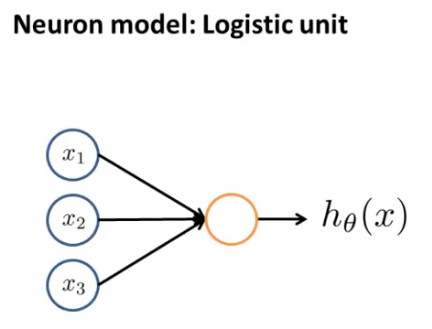
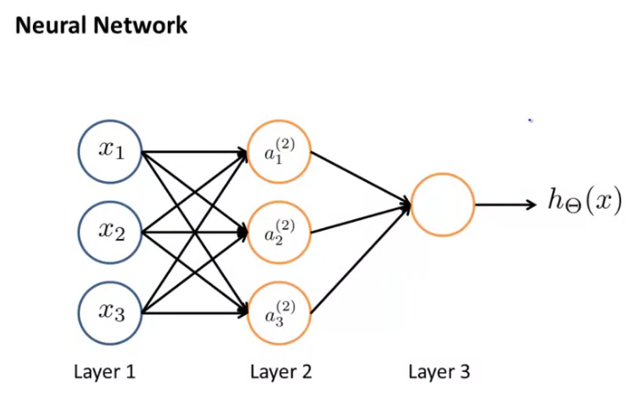
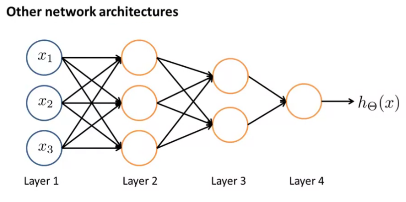

# Neural Networks

- Origins: algorithms that try to mimic the brain;
- Widely used in 80s and early 90s:
  - Popularity diminished in the late 90s;
- Recent resurgence: State-of-the-art technique for many applications.

### Model representation

where $h_{\theta}(x) = \displaystyle\frac{1}{1 + e^{-\theta^T x}}$ , with:
$$
x =
\begin{bmatrix}
x_0 \\ x_1 \\ x_2 \\ x_3
\end{bmatrix}
\quad\quad
\theta = 
\begin{bmatrix}
\theta_0 \\ \theta_1 \\ \theta_2 \\ \theta_3
\end{bmatrix} .
$$
$x_0 = 1$ is also called **bias**. It is sometimes omitted in the diagrams.

The sigmoid function works as the **activation function**.

Layer 1 is called the **input layer**.

Layer 2 is the **hidden layer**.

Layer 3 is also known as  the **output layer**.

$a_{i}^{(j)}$ : 'activation' of unit $i$ in layer $j$ ;

$\Theta^{(j)}$ : matrix of weights controlling function mapping from layer $j$ to layer $j + 1$.

Since the previous model has three input units (four with the bias) and three hidden units, $\Theta^{(1)} \in \mathbb{R}^{3 \times 4}$ :

- In this case, the matrix of weights is supposed to be pre-multiplied by the input vector (without transposition).

Thus, the model represented in the preceding diagram can be written as:
$$
a_{1}^{(2)} =
g\big(\Theta_{10}^{(1)} x_0 + \Theta_{11}^{(1)} x_1 + \Theta_{12}^{(1)} x_2 + \Theta_{13}^{(1)} x_3\big) \\
a_{2}^{(2)} =
g\big(\Theta_{20}^{(1)} x_0 + \Theta_{21}^{(1)} x_1 + \Theta_{22}^{(1)} x_2 + \Theta_{23}^{(1)} x_3\big) \\
a_{3}^{(2)} =
g\big(\Theta_{30}^{(1)} x_0 + \Theta_{31}^{(1)} x_1 + \Theta_{32}^{(1)} x_2 + \Theta_{33}^{(1)} x_3\big) \\
h_{\Theta}(x) = a_{1}^{(3)} =
g\big(\Theta_{10}^{(2)} a_0^{(2)} + \Theta_{11}^{(2)} a_1^{(2)} + \Theta_{12}^{(2)} a_2^{(2)} + \Theta_{13}^{(2)} a_3^{(2)}\big)
$$
If a network has $s_j$ units in layer $j$ , $s_{j+1}$ in layer $j+1$, then $\Theta^{(j)}$ will be of dimension $s_{j+1} \times (s_{j} + 1) $.

- The unit added to the second dimension accounts for the <u>bias</u> (which is <u>inputted to every layer</u>).

##### Forward propagation: vectorized implementation

$$
z^{(2)} =
\begin{bmatrix}
z_{1}^{(2)} \\ z_{2}^{(2)} \\ z_{3}^{(2)}
\end{bmatrix}
=
\begin{bmatrix}
\Theta_{10}^{(1)} x_0 + \Theta_{11}^{(1)} x_1 + \Theta_{12}^{(1)} x_2 + \Theta_{13}^{(1)} x_3 \\
\Theta_{10}^{(1)} x_0 + \Theta_{11}^{(1)} x_1 + \Theta_{12}^{(1)} x_2 + \Theta_{13}^{(1)} x_3 \\
\Theta_{10}^{(1)} x_0 + \Theta_{11}^{(1)} x_1 + \Theta_{12}^{(1)} x_2 + \Theta_{13}^{(1)} x_3
\end{bmatrix}
$$

$$
x =
\begin{bmatrix}
x_0 \\ x_1 \\ x_2 \\ x_3
\end{bmatrix}
\Rightarrow
\quad
\begin{matrix}
z^{(2)} = \Theta^{(1)} x \\
a^{(2)} = g(z^{(2)})
\end{matrix}
$$

The input units $x$ may as well be understood as the activation of the first layer, that is, $a^{(1)}$ .
$$
\begin{matrix}
z^{(2)} = \Theta^{(1)} a^{(1)} \\
a^{(2)} = g(z^{(2)})
\end{matrix}
$$
Then, **add** $a_0^{(2)} = 1$, and proceed:
$$
\begin{matrix}
z^{(3)} = \Theta^{(2)} a^{(2)} \\
h_{\Theta}(x) = a^{(3)} = g(z^{(3)})
\end{matrix}
$$
More generally:
$$
\begin{matrix}
z^{(j+1)} = \Theta^{j} a^{(j)} \\
a^{(j+1)} = g(z^{(j+1)})
\end{matrix}
$$

### Multi-class classification

Multiple output units: One-vs-all.

Thus, for the first class (out of three): $h_{\Theta}(x) = \begin{bmatrix} 1 \\ 0 \\ 0\end{bmatrix}$ ;

The second and third classes: $h_{\Theta}(x) = \begin{bmatrix} 0 \\ 1 \\ 0\end{bmatrix}$ and $h_{\Theta}(x) = \begin{bmatrix} 0 \\ 0 \\ 1\end{bmatrix}$ ;

And so on.

The training set will then be: $ (x^{(1)},y^{(1)}), (x^{(2)},y^{(2)}), ..., (x^{(m)},y^{(m)}) $, 

where:
$$
y^{(i)} \in
\begin{Bmatrix}
\begin{bmatrix} 1\\0\\0 \end{bmatrix} ,
\begin{bmatrix} 0\\1\\0 \end{bmatrix} ,
\begin{bmatrix} 0\\0\\1 \end{bmatrix}
\end{Bmatrix}.
$$

