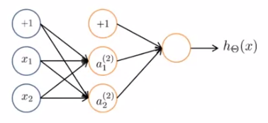

# Neural Networks

$$
\{ (x^{(1)},y^{(1)}), (x^{(2)},y^{(2)}), ..., (x^{(m)},y^{(m)})\} \\

L = \textrm{total no. of layers in network} \\

s_{l} = \textrm{no. of units (not counting bias unit) in layer } l
$$

**Binary classification**: $y = 0 \textrm{ or } 1$:

- $h_{\Theta} \in \mathbb{R}$ ;
- $s_L = 1$ .

**Multi-class classification** ($K$ classes): $y \in \mathbb{R}^{K}$ :
$$
y \in
\begin{Bmatrix}
\begin{bmatrix} 1 \\ 0 \\ 0 \\ \vdots \\ 0 \end{bmatrix},
\begin{bmatrix} 0 \\ 1 \\ 0 \\ \vdots \\ 0 \end{bmatrix},
\cdots ,
\begin{bmatrix} 0 \\ 0 \\ 0 \\ \vdots \\ 1 \end{bmatrix}
\end{Bmatrix}
$$

- $h_{\Theta} \in \mathbb{R}^K$ ;
- $s_L = K$ .

### Cost function

- Generalization of the logistic regression's cost function:
  - $h_{\Theta} (x) \in \mathbb{R}^K$: $\big(h_{\Theta}(x)\big)_{i} = i$-th output.

$$
J(\Theta) = -\displaystyle\frac{1}{m}
\Bigg[
\displaystyle\sum_{i=1}^{m} \displaystyle\sum_{k=1}^{K}
y_{k}^{(i)} \log(h_{\Theta}(x^{(i)}))_k \\
+ (1-y_{k}^{(i)}) \log(1-(h_{\Theta}(x^{(i)}))_k)
\Bigg] \\
+ \displaystyle\frac{\lambda}{2m}
\displaystyle\sum_{l=1}^{L-1}
\displaystyle\sum_{i=1}^{s_l}
\displaystyle\sum_{j=1}^{s_l+1} (\Theta_{ji}^{(l)})^2
$$

### Back-propagation Algorithm

- Aim: $\underset{\Theta}{min} J$.

- Need to compute:
  - $J(\Theta)$ ;
  - $\displaystyle\frac{\partial}{\partial \Theta_{ij}^{(l)}} J(\Theta)$ .

**Computation**:

Given one training example $(x,y)$:

- Forward propagation:

$$
\begin{align}
& a^{(1)} = x \\
& z^{(2)} = \Theta^{(1)} a^{(1)} \\
& a^{(2)} = g(z^{(2)}) \quad (\textrm{add } a_{0}^{(2)}) \\
& z^{(3)} = \Theta^{(2)} a^{(2)} \\
& a^{(3)} = g(z^{(3)}) \quad (\textrm{add } a_{0}^{(3)}) \\
& z^{(4)} = \Theta^{(3)} a^{(3)} \\
& a^{(4)} = h_{\Theta}(x) = g(z^{(4)})
\end{align}
$$

Intuition: $\delta_{j}^{(l)} = $ "error" of node $j$ in layer $l$.

For each **output** unit (*e. g.*, layer L= 4):

- $\delta_{j}^{(4)} = a_{j}^{(4)} - y_j$ :
  - $a_{j}^{(4)} = (h_{\Theta} (x))_j$ .

- $\delta^{(3)} = (\Theta^{(3)})^T \delta^{(4)} \odot g'(z^{(3)})$ :
  - $g' (\cdot)$ is the derivative of the activation function;
  - For the sigmoid function, $g'(z^{(3)}) = a^{(3)} \cdot (1-a^{(3)})$ .
- $\delta^{(2)} = (\Theta^{(2)})^T \delta^{(3)} \odot g'(z^{(2)})$ ;
- There is no $\delta^{(1)}$ .

$$
\displaystyle\frac{\partial}{\partial \Theta_{ij}^{(l)}} J(\Theta) = a_{j}^{(l)} \delta_i^{(l+1)} \quad (\lambda = 0)
$$

**Algorithm**:

Training set $\bigg\{ \big( x^{(1)}, y^{(1)} \big), \big( x^{(2)}, y^{(2)} \big), ..., \big( x^{(m)}, y^{(m)} \big) \bigg\}$ .

Set $\Delta_{ij}^{(l)} = 0 \quad (\forall\ l, i, j)$.

For $i = 1 \textrm{ to } m$ :

- Set $a^{(1)} = x^{(i)}$ ;
- Perform forward propagation to compute $a^{(l)}$ for $l = 2,3,...,L$ ;
- Using $y^{(i)}$, compute $\delta^{(L)} = a^{(L)} - y^{(i)}$ ;
- Compute $\delta^{(L-1)}, \delta^{(L-2)}, ..., \delta^{(2)}$ ;
- $\Delta_{ij}^{(l)} := \Delta_{ij}^{(l)} + a_{j}^{(l)} \delta_{i}^{(l+1)}$ :
  - <u>Matrix form</u>: $\Delta^{(l)} := \Delta^{(l)} + \delta^{(l+1)} (a^{(l)})^T$ .

$$
D_{ij}^{(l)} := 
\begin{cases}
\displaystyle\frac{1}{m} \Delta_{ij}^{(l)} + \lambda \Theta_{ij}^{(l)}, & j \neq 0 \\
\displaystyle\frac{1}{m} \Delta_{ij}^{(l)}, & j=0
\end{cases}
\quad \Rightarrow \quad
\displaystyle\frac{\partial}
{\partial\Theta_{ij}^{(l)}} J(\Theta) = D_{ij}^{(l)}
$$

**Unrolling parameters**:

Example:
$$
\begin{align}
& s_1 = 10, s_2 = 10, s_3 = 1 \\
& \Theta^{(1)} \in \mathbb{R}^{10 \times 11},
\Theta^{(2)} \in \mathbb{R}^{10 \times 11},
\Theta^{(3)} \in \mathbb{R}^{1 \times 11} \\
& D^{(1)} \in \mathbb{R}^{10 \times 11},
D^{(2)} \in \mathbb{R}^{10 \times 11},
D^{(3)} \in \mathbb{R}^{1 \times 11}
\end{align}
$$

~~~octave
thetaVec = [Theta1(:); Theta2(:); Theta3(:)];
DVec = [D1(:); D2(:); D3(:)];
...
Theta1 = reshape(thetaVec(1:110), 10, 11);
Theta2 = reshape(thetaVec(111:220), 10, 11);
Theta3 = reshape(thetaVec(221:231), 1, 11);
~~~

**Learning algorithm**:

Have initial parameters $\Theta^{(1)}, \Theta^{(2)}, \Theta^{(3)}$ .

Unroll to get `initialTheta` to pass to `fminunc(@costFuncion, initialTheta, options)`.

`function [jVal, gradientVec] = costFunction(thetaVec)`:

- From `thetaVec`, get $\Theta^{(1)}, \Theta^{(2)}, \Theta^{(3)}$.
- Use forward prop/back prop to compute $D^{(1)}, D^{(2)}, D^{(3)} \textrm{ and } J(\Theta)$.
- Unroll  $D^{(1)}, D^{(2)}, D^{(3)}$ to get `gradientVec`.

##### Numerical estimation of gradients

###### Two-sided difference:

$$
\displaystyle\frac{d}{d\Theta} J(\Theta) \approx
\displaystyle\frac{J(\Theta + \varepsilon) - J(\Theta - \varepsilon)}{2 \varepsilon} ,
\quad \varepsilon \ll 1 .
$$

- For instance, $\varepsilon = 10^{-4}$.

###### One-sided difference:

$$
\displaystyle\frac{d}{d\Theta} J(\Theta) \approx
\displaystyle\frac{J(\Theta + \varepsilon) - J(\Theta)}{\varepsilon} ,
\quad \varepsilon \ll 1 .
$$

- The two-sided difference usually provides a better estimation.

###### Implementation:

~~~octave
gradApprox = (J(theta + EPSILON) - J(theta - EPSILON))/(2*EPSILON)
~~~

###### Parameter vector $\theta$ :

$\theta \in \R^n$ : *e. g.*, $\theta$ is the 'unrolled' version of $\Theta^{(1)}, \Theta^{(2)}, \Theta^{(3)}$

$\theta = \theta_1, \theta_2, ... ,\theta_n$

Then,
$$
\begin{align}
& \displaystyle\frac{\partial}{\partial \theta_1}J(\theta) \approx 
\displaystyle\frac{J(\theta_1+\varepsilon, \theta_2, ..., \theta_n) - J(\theta_1-\varepsilon, \theta_2, ..., \theta_n)}{2\varepsilon} \\
& \displaystyle\frac{\partial}{\partial \theta_2}J(\theta) \approx 
\displaystyle\frac{J(\theta_1,\theta_2+\varepsilon, ..., \theta_n) - J(\theta_1,\theta_2-\varepsilon, ..., \theta_n)}{2\varepsilon} \\
& \quad\vdots \\
& \displaystyle\frac{\partial}{\partial \theta_n}J(\theta) \approx 
\displaystyle\frac{J(\theta_1,\theta_2, ..., \theta_n+\varepsilon) - J(\theta_1,\theta_2, ..., \theta_n-\varepsilon)}{2\varepsilon} \\
\end{align}
$$

###### Implementation:

~~~octave
for i = 1:n,
	thetaPlus = theta;
	thetaPlus(i) = thetaPlus(i) + EPSILON;
	thetaMinus = theta;
	thetaMinus(i) = thetaMinus(i) - EPSILON;
	gradApprox(i) = (J(thetaPlus) - J(thetaMinus))/(2*EPSILON);
end;
~~~

- Check that `gradApprox` $\approx$ `DVec`.
  - `DVec` results from back-propagation.

###### Implementation note:

- Implement backprop to compute `DVec` (unrolled $D^{(1)},D^{(2)},D^{(3)}$).
- Implement numerical gradient check to compute `gradApprox`.
- Make sure they give similar values.
- Turn off gradient checking. Using backprop code for learning.

###### <u>Important</u>:

Be sure to disable your gradient checking code before training your classifier. If you run numerical gradient computation on every iteration of gradient descent (or in the inner loop of `costFunction(...)`) your code will be <u>very</u> slow.

### Random initialization

###### Initial value of $\Theta$ :

For gradient descent and advanced optimization method, we need an initial value for $\Theta$ .

- `optTheta = fminunc(@costFunction, initialTheta, options)` .

Consider gradient descent:

- Set `initialTheta = zeros(n,1)`?

Zero initialization:

- If $\Theta^{(l)}_{ij} = 0, \ \forall\ i,j,l$ :
  - $a^{(2)}_{1} = a^{(2)}_{2}$ and $\delta^{(2)}_{1} = \delta^{(2)}_{2}$ ;
  - $\displaystyle\frac{\partial}{\partial \Theta^{(1)}_{01}} J(\Theta) = \displaystyle\frac{\partial}{\partial \Theta^{(1)}_{02}} J(\Theta)$ and $\Theta^{(1)}_{01} = \Theta^{(1)}_{02}$ ;
  - After each update, parameters corresponding to inputs going into each two hidden units are identical.

Random initialization: Symmetry breaking

- Initialize each $\Theta^{(l)}_{ij}$ to a random value in $[-\epsilon, \epsilon]$ : $-\epsilon \leq \Theta^{(l)}_{ij} \leq \epsilon$ .
  - This $\epsilon$ is unrelated to that of gradient checking.

~~~octave
Theta1 = rand(10,11) * (2*INIT_EPSILON) - INIT_EPSILON;
Theta2 = rand(1,11) * (2*INIT_EPSILON) - INIT_EPSILON;
~~~

### Putting it together

**Training a neural network**

Pick a network architecture (connectivity pattern between neurons)

- Number of input units: dimension of features $x^{(i)}$ ;
- Number of output units: number of classes;
- Reasonable default: one hidden layer:
  - If more than one hidden layer, have the same number of hidden units in every layer (usually the more the better).

Steps:

1. Randomly initialize weights;
2. Implement forward propagation to get $h_{\Theta}(x^{(i)})$ for any $x^{(i)}$ ;
3. Implement code to compute cost function $J(\Theta)$ ;
4. Implement back-prop to compute partial derivatives $\displaystyle\frac{\partial}{\partial \Theta^{(l)}_{jk}} J (\Theta)$ .

`for i = 1:m`

- Perform forward propagation and back-propagation using example $(x^{(i)}, y^{(i)})$;
  - Get activations $a^{(l)}$ and delta terms $\delta^{(l)}$ for $l = 2,3,...,L$ .

5. Use gradient checking to compare $\displaystyle\frac{\partial}{\partial \Theta^{(l)}_{jk}}J(\Theta)$ computed using back-propagation vs. using numerical estimate of gradient of $J(\Theta)$.

- Then disable gradient checking code.

6. Use gradient descent or advanced optimization method with back-propagation to try to minimize $J(\Theta)$ as a function of parameters $\Theta$ .